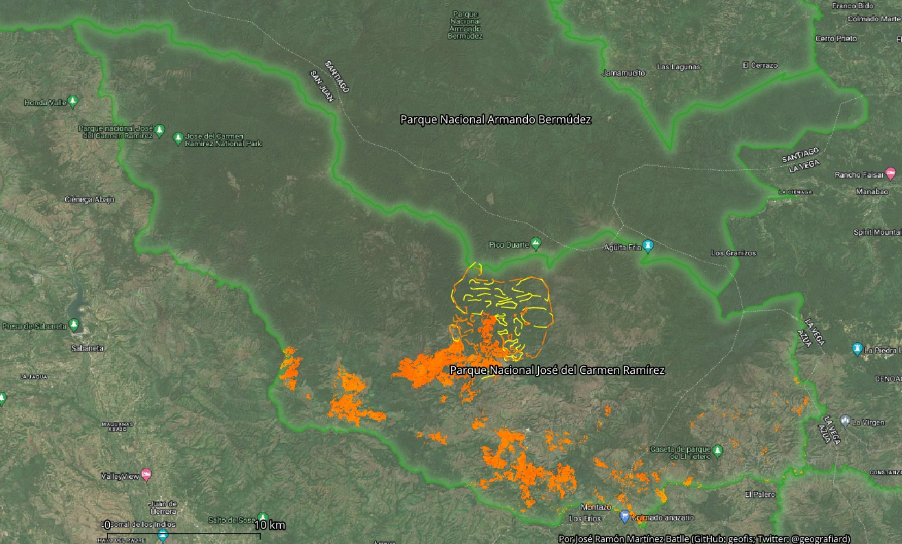

```{r supsetup, include=FALSE}
knitr::opts_chunk$set(
  cache = F, 
  echo = TRUE,
  warning = FALSE,
  message = FALSE,
  out.width = '100%',
  dpi = 300)
# options(digits = 3)
```

`r if(knitr::opts_knit$get("rmarkdown.pandoc.to") == 'gfm-yaml_metadata_block') 'Versión HTML (más legible e interactiva), [aquí](https://geofis.github.io/fuego-jose-del-carmen-ramirez-2023/README.html)'`

`r if(knitr::opts_knit$get("rmarkdown.pandoc.to") == 'latex') 'Versión HTML (quizá más legible), [aquí](https://geofis.github.io/fuego-jose-del-carmen-ramirez-2023/README.html)'`

```{r}
# Paquetes
library(raster)
library(sf)
library(kableExtra)
library(tidyverse)
estilo_kable <- function(df, titulo = '', cubre_anchura = T) {
  df %>% kable(format = 'html', escape = F, booktabs = T, digits = 2, caption = titulo) %>%
  kable_styling(bootstrap_options = c("hover", "condensed"), full_width = cubre_anchura)
}

#Todo el parque. Límite mínimo del intervalo
dnbr <- raster('fuentes/dNBR-jose-del-carmen-ramirez-2023-masked-reclass-majority.tif')
esa <- raster('fuentes/esa-jose-del-carmen-ramirez-2023.tif')
dnbr <- resample(dnbr, esa)
dnbr[dnbr==0] <- NA
if(interactive()) plot(dnbr)
april_8 <- st_read('fuentes/mascara-quemado-inferido-imputado-from-landsat-april-8.gpkg', quiet = T)
dnbr_april8 <- rasterize(as(april_8, 'Spatial'), y = dnbr, field = 'DN', update = T)
if(interactive()) plot(dnbr_april8)
cross_tab_parque_min <- crosstab(dnbr_april8, esa)
cross_tab_parque_min <- cross_tab_parque_min[2, 2:ncol(cross_tab_parque_min)]
names(cross_tab_parque_min) <- c("Trees", "Shrubland", "Grassland", "Cropland",
                      "Built-up", "Barren / sparse vegetation", "Open water")
cross_tab_parque_min <- cross_tab_parque_min[c("Trees", "Shrubland",
                                                 "Grassland", "Cropland")]
pct_parque_min <- round(prop.table(cross_tab_parque_min)*100, 2)
km2_parque_min <- cross_tab_parque_min * prod(res(dnbr_april8))/1000000
total_km2_parque_min <- sum(km2_parque_min)

#Todo el parque. Límite máximo del intervalo
hotspots <- st_read('fuentes/mascara-quemado-inferido-imputado-from-hotspots.gpkg', quiet = T)
dnbr_april8_hotspots <- rasterize(as(hotspots, 'Spatial'),
                                  y = dnbr_april8, field = 'DN', update = T)
if(interactive()) plot(dnbr_april8_hotspots)
cross_tab_parque_max <- crosstab(dnbr_april8_hotspots, esa)
cross_tab_parque_max <- cross_tab_parque_max[2, 2:ncol(cross_tab_parque_max)]
names(cross_tab_parque_max) <- c("Trees", "Shrubland", "Grassland", "Cropland",
                      "Built-up", "Barren / sparse vegetation", "Open water")
cross_tab_parque_max <- cross_tab_parque_max[c("Trees", "Shrubland",
                                                 "Grassland", "Cropland")]
pct_parque_max <- round(prop.table(cross_tab_parque_max)*100, 2)
km2_parque_max <- cross_tab_parque_max * prod(res(dnbr_april8))/1000000
total_km2_parque_max <- sum(km2_parque_max)

#Área de alarma social (próxima al pico Duarte). Límite mínimo del intervalo
aoi <- st_read('fuentes/sector-norte-frontera-agropecuaria.gpkg', quiet = T)
dnbr_april8_aoi <- mask(crop(dnbr_april8, extent(aoi)), aoi)
esa_aoi <- mask(crop(esa, extent(aoi)), aoi)
cross_tab_aoi_min <- crosstab(dnbr_april8_aoi, esa_aoi)
cross_tab_aoi_min <- cross_tab_aoi_min[, 2:4]
names(cross_tab_aoi_min) <- c("Trees", "Shrubland", "Grassland")
pct_aoi_min <- round(prop.table(cross_tab_aoi_min)*100, 2)
km2_aoi_min <- cross_tab_aoi_min * prod(res(dnbr_april8_aoi))/1000000
total_km2_aoi_min <- sum(km2_aoi_min)

#Área de alarma social (próxima al pico Duarte). Límite máximo del intervalo
dnbr_april8_hotspots_aoi <- mask(crop(dnbr_april8_hotspots, extent(aoi)), aoi)
cross_tab_aoi_max <- crosstab(dnbr_april8_hotspots_aoi, esa_aoi)
cross_tab_aoi_max <- cross_tab_aoi_max[, 2:4]
names(cross_tab_aoi_max) <- c("Trees", "Shrubland", "Grassland")
pct_aoi_max <- round(prop.table(cross_tab_aoi_max)*100, 2)
km2_aoi_max <- cross_tab_aoi_max * prod(res(dnbr_april8_hotspots_aoi))/1000000
total_km2_aoi_max <- sum(km2_aoi_max)
```

> Contribuye a enmarcar adecuadamente la narrativa sobre este incendio. No se trata del "incendio en el pico Duarte", se trata de una desproporcionada actividad de quema DENTRO del parque nacional José del Carmen Ramírez, una de las áreas protegidas más amenazadas en nuestro país por la agricultura migratoria.



## Resultados

### El dato (en desarrollo)

Un incendio forestal que inició en marzo sobre el parque nacional José del Carmen Ramírez, cordillera Central de República Dominicana, quemó superficies considerables de bosque de pinar. El hecho de que algunos focos se acercaran al pico Duarte, popularizó este desafortunado episodio de la historia del parque. Aunque es probable que hayas llegado hasta aquí buscando "cuánto se quemó", nos gustan los números.

> "A los mayores les gustan las cifras". Antoine de Saint-Exupéry, *El principito*

En lugar de darte una cifra cerrada, pues se trata de un evento aún en desarrollo (a 8 de abril de 2023), mejor te ofrezco un intervalo: **`r round(total_km2_aoi_min,2)` $\leq$ valor definitivo $\leq$ `r round(total_km2_aoi_max,2)`** $km^2$ (consulta la sección [Método](#metodo) para obtener detalles sobre el procedimiento de cálculo). Prácticamente todo lo quemado es bosque de distintas densidades, pero también hay herbazales (cf. pajonales). Este intervalo contiene, con cierto nivel de confianza, **la cantidad final de kilómetros cuadrados de área boscosa (en general, pinar) quemados durante marzo en el "área de mayor preocupación", que es el borde norte del parque nacional José del Carmen Ramírez en su aproximación hacia el pico Duarte**. Como aclaré, esta área se quemó producto de un foco que inició a finales de marzo en cobertura no boscosa (e.g. frontera agrícola), y que remontó hacia el norte, adentrándose en el bosque y acercándose bastante al pico Duarte, donde produjo "alarma social".

¿Por qué es tan amplio el intervalo? Porque para obtenerlo por medio de imágenes satelitales, dependemos de que las nubes "nos dejen brechar" el terreno. Las estimaciones de superficie quemada realizadas en tierra, son de hecho más precisas en los primeros momentos, pero una vez obtengamos una buena escena del área (sin nubes, y no mucho tiempo despues de la fecha de extinción del incendio), las estimaciones por medio de imágenes serán mejores.

Pero enmarquemos el problema. Es marzo, las precipitaciones son muy reducidas y la preparación de tierras usando quemas está en su momento más álgido; el parque es, literalmente, un fogón. Es por esta razón que me interesa darle el contexto requerido a este incendio: todo comenzó dentro de un parque nacional con una incesante actividad agrícola, donde la quema se usa de manera regular (DENTRO del parque, reitero). Por esta razón, si analizamos lo que ocurrió fuera del área de "alarma social", no nos debería sorprender que las cifras de superficies quemadas sean enormes. Veamos el dato, también como intervalo: **`r round(total_km2_parque_min,2)` $\leq$ valor definitivo $\leq$ `r round(total_km2_parque_max,2)`** $km^2$. Este intervalo contiene **la cantidad de terreno quemado a partir del 21 de febrero hasta abril dentro del área protegida** (en enero también se quemó otro poco). Mucho fue pastizal, matorral o bosque secundario, pero recuerda, es parque nacional. La distribución, según coberturas, es como sigue: en el escenario de menor área quemada, sería `r round(km2_parque_min[1], 2)` $km^2$ de bosque, y en el escenario de mayor área quemada `r round(km2_parque_max[1], 2)` $km^2$.

![Áreas quemadas en el parque nacional José del Carmen Ramírez, marzo-abril de 2023. El detalle muestra amplía el borde norte que enlaza con el PN Armando Bermúdez. Los polígonos sombreados en naranja son áreas quemadas calculadas por el método dNBR, que ofrece una alta confiabilidad. Los polígonos de trazo discontinuo son áreas que se han imputado como quemadas; los de color amarillo proceden de interpretación visual de imagen Landsat 9 de 8 abril (confiable), y los de color naranja, envolventes convexas de los puntos de calor / anomalías térmicas de FIRMS.](img/dnbr-interpretacion-visual-8-abril-hotspots.jpg)

No nos hemos "sentado" a tener esta discusión a nivel de país, aunque esta realmente la norma respecto del conjunto de nuestro sistema de áreas protegidas. Ni siquiera las áreas más carismáticas, como Los Haitises, sierra de Bahoruco o Valle Nuevo, han podido salir de este círculo de degradación ambiental. No obstante, de éstas se habla, "salen" en los medios, pero el parque nacional José del Carmen Ramírez no suele mencionarse.

Hay algunas señales preocupantes sobre lo que está ocurriendo en el parque nacional José del Carmen Ramírez. Año tras año, la frontera agrícola avanza más y más hacia el norte y al oeste, que son los únicos cuadrantes todavía con bosque del área protegida. En concreto, en la loma El Picacho (oeste del parque) un incendio consumió varias hectáreas de bosque.


Si buscas su importancia encontrarás referencias al agua, la biodiversidad y otros valores. Te lo voy a poner fácil: sin José del Carmen Ramírez no habrá Armando Bermúdez y, sin este último, "se pué cuidá el Cibao (y to' el país)". No perdamos el foco, esto es serio, el país necesita esta discusión.

## Método {#metodo}

### Obtención de los intervalos

Usé escenas Sentinel 2 para caracterizar la superficie quemada durante todo el mes de marzo y parte de abril. La fuente prefuego fue una composición promediada de escenas 22/02/2023 y 27/02/2023; la fuente posfuego fue una única escena, de fecha 3/04/2023. Para extraer la superficie quemada, apliqué una versión modificada del [*script* Google Earth Engine de UN-Spider "BURN SEVERITY MAPPING USING THE NORMALIZED BURN RATIO (NBR)"](https://un-spider.org/advisory-support/recommended-practices/recommended-practice-burn-severity/burn-severity-earth-engine), que consiste en calcular la severidad de quemado usando el diferencial del índice normalizado de quema (dNBR). Este método ofrece el cálculo más consistente y preciso de superficie quemada disponible actualmente. Una vez obtenido este cómputo, interpretando visualmente la escena Landsat 9 de 8/04/2023, extraje las áreas quemadas que eran visibles entre las densas nubes que cubrieron la zona ese día. Imputé estas áreas complementarias a la superficie calculada por dNBR, y con esto obtuve el límite inferior del intervalo.

Para obtener el límite superior del intervalo agregué, al computo anterior, superficies imputadas como quemadas, las cuales construí a partir de envolventes convexas de los puntos de calor / anomalías térmicas de FIRMS correspondientes a los 7 días anteriores al 8/04/2023. Normalmente, los puntos de calor cubren un área de mayor extensión que la superficie quemada, pues el fuego no quema de forma continua ni en todo el perímetro. Además los puntos de calor son producidos por algoritmos de detección de anomalía térmica, no determinando área quemada. Finalmente, estos puntos son generados a partir de imágenes de resolución inferior a las usadas para obtener el cómputo por dNBR.

Aplicaré el método del dNBR de forma consistente en la medida en la que nuevas escenas se hagan disponibles. De esta manera, encogeré la anchura del intervalo en próximas actualizaciones. "Mantengan la sintonía".

### La cobertura "bosque"

La superficie de bosque, que se trata sobre todo de pinar, parte del dato ofrecido por la ESA [@zanagadaniele2022]. Realicé un simple chequeo cruzado de esta fuente, y noté un error muy común en estas clasificaciones: las áreas situadas en sombra de relieve, sobre todo en contextos muy intervenidos o de cobertura variable, suelen aparecer clasificadas como bosque cuando probablemente son sólo pastizales o matorrales. Es decir, en general, la cobertura "*tree cover*" de @zanagadaniele2022 está sobrestimada en áreas intervenidas. Una alternativa sería usar la capa de cobertura forestal dominicana del estudio de 2019, siempre que esté disponible sin previa petición, que no es el caso (ya estoy muy viejo para estar escribiendo la típica carta). Hay más alternativas, como [Copernicus Global Land Cover Layers](https://developers.google.com/earth-engine/datasets/catalog/COPERNICUS_Landcover_100m_Proba-V-C3_Global) o [Hansen Global Forest Change v1.9 (2000-2021)](https://developers.google.com/earth-engine/datasets/catalog/UMD_hansen_global_forest_change_2021_v1_9), pero no encontraremos grandes diferencias, al menos en la parte más boscosa del parque. No obstante, la fuente suele ser consistente en áreas donde el bosque es generalizado, lo cual en el parque nacional José del Carmen Ramírez, ocurre hacia el norte y al noroeste.

## Referencias
